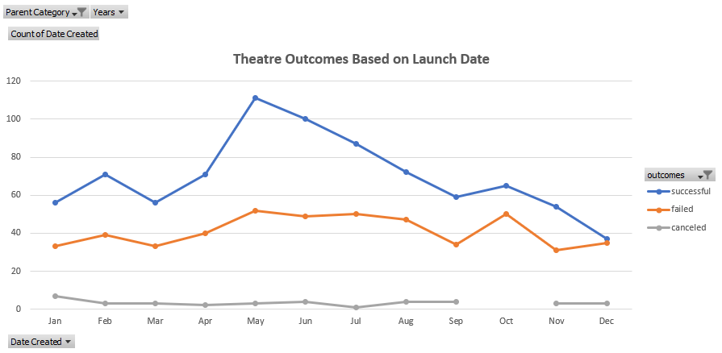
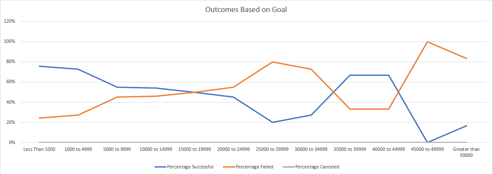

# An Analysis of Kickstarter Campaigns in the Theater & Play Categories Evaluating Outcomes Based on Launch Date and Goals
The purpose of the findings contained in this analysis will be directional in determining optimal goal setting and campaign lauch dates.
---
# Analysis and Challenges
*First, I analyzed the Theater Kickstarter campaigns by launch date to determine if there was a specific month associated with more successful campaigns.
---

---
*Next, I analyzed the Play Kickstarter campaigns by goal to better understand if there were any trends associated with Kickstarter goals and success rate.
---

---
*One challenge in evaluating this data is the limited information regarding campaigns with goals over $25,000. Because of this lack of data compared to campaigns with lower goals, it is more difficult to confidently say there is concrete evidence of failure being specifically due to higher targets. Another challenge is that while May and June have the most successful campaigns, there is also significantly more competition in receiving funding during those months due to the significant uptick in total campaigns that begin during those months, so percent successful is also an important factor to consider.
---
# Results
1 Two conclusions that can be drawn from the Theatre Outcomes Based on Launch Date analysis are that May and June have the highest number of successful campaigns, as well as the highest percentage in successful campaigns. Additionally, those months also will be the most competitive to receive funding due to the popularity of launching a campaign during that time. Ultimately, Feb-April may be options worth considering if you believe competition to be a major factor in whether you'll receive funding, as the percent likelihood of success is ~62%, just 4 percentage points below the much more popular months of May and June.
---
2 From analyzing Outcomes Based on Goals, we see that as campaign goals grow, the success rate consistently falls until we reach the $25,000 goal mark, at which point there is likely too little data to feel confident in using it. Even as the data becomes thinner and noisier above $25,000, the general trend remains the same with some outliers.
---
3 This data is limited to only Kickstarter campaigns, and alternative funding platform data (if such exist) would help provide more clarity to the analysis as it could support or completely stray from the conclusions we can make with Kickstarters. Additionally, data around popular mainstream funded projects could also help us understand if there are any external influences that factor into which campaigns are successful in a given year.
---
4 Some other analysis we could do is run a regression model to understand what the optimal goal amount should be, as the range of success rate from >$1000 to $25,000 is nearly 60% and including other variables into the regression model like launch month could better inform and link the analysis. Additionally, further analysis around backers count could help us understand backer behavior and any links to time of year or funding goals.
---

