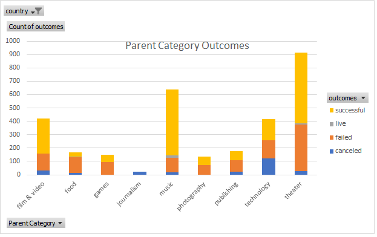

# An Analysis of Kickstarter Campaigns (Excel File in Google Drive link as file exceeded 25 MB Compressed)
Performing analysis on Kickstarter data to uncover trends inorder to best position a Kickstarter Campaign for plays in the United States

# Link to Excel
[Kickstarter Analysis](https://drive.google.com/file/d/1aTCZ5YLa2bIb324H1nM-IDveQ7_MfrjR/view?usp=sharing)

# Findings
*Date of Kickstarter campaign launch is an important factor to consider when planning

*Theatre Kickster campaigns lead in popularity, and while theatre campaigns have the largest number of successful fundings, they also fail more than others

*Successful US theatre/play kickstarters have an average funding goal of around $5,000, while those failed have an average funding goal over $10,0000

# Recommendations
1 Launch your kickstarter campaign in May, as the data shows May and June are the two best months to run campaigns
2 Ensure your goal funding amount is as lean as possible, as successful campaigns average goals 1/2 the size of your projected goal
